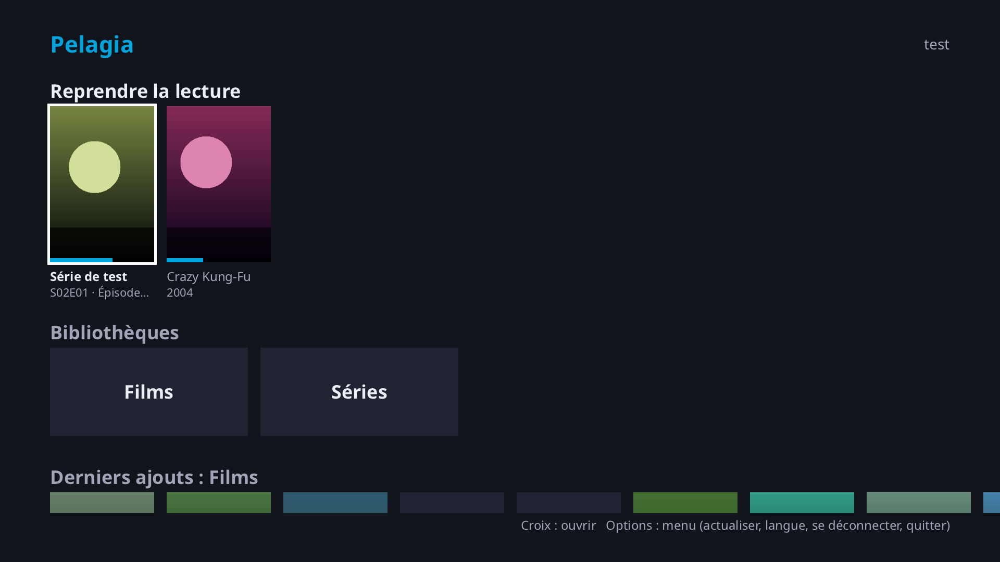
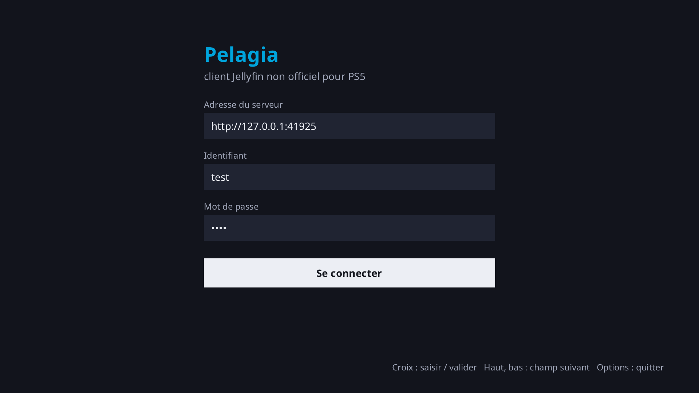
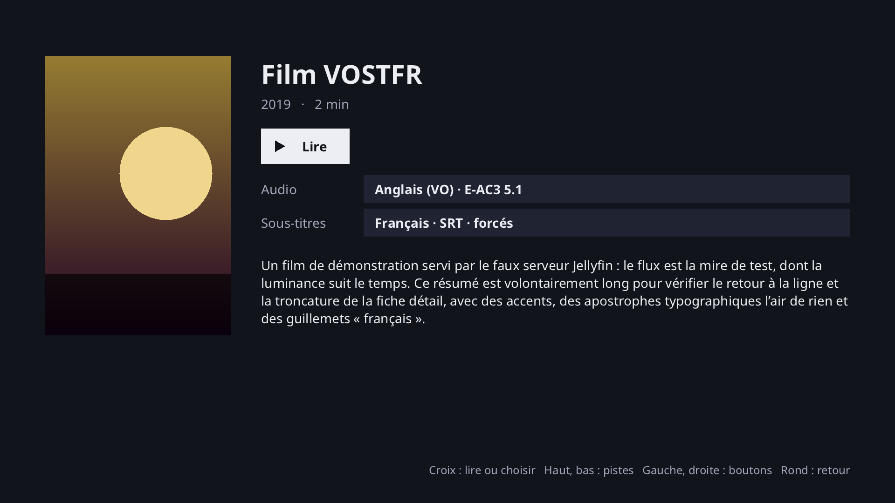
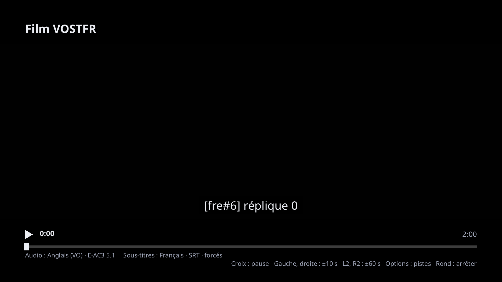

# Pelagia — client Jellyfin non officiel pour PS5

🇬🇧 [Read in English](README.md)

**Pelagia** apporte **Jellyfin sur PS5** : un client Jellyfin natif pour PlayStation 5 jailbreakée
(homebrew), piloté entièrement à la manette. Parcourez les bibliothèques de votre serveur Jellyfin
auto-hébergé, choisissez vos pistes audio et vos sous-titres, et regardez vos films et séries sur votre
télévision en reprenant là où vous vous étiez arrêté.

> **Pelagia est un projet non officiel.** *Jellyfin est une marque du projet Jellyfin ; Pelagia n'est pas
> affilié au projet Jellyfin ni à Sony.* PlayStation et PS5 sont des marques de Sony Interactive
> Entertainment. Pelagia est réservé à du matériel que vous possédez et à des contenus que vous avez le
> droit de regarder.



| | | |
|---|---|---|
|  |  |  |

## Fonctionnalités

- Connexion à votre serveur Jellyfin avec un clavier virtuel ; la session est conservée (le token
  seulement, le mot de passe n'est jamais enregistré).
- Accueil avec **Reprendre la lecture**, bibliothèques et derniers ajouts ; grilles d'affiches ; fiches de
  films et d'épisodes ; séries > saisons > épisodes.
- Lecture en 1080p avec décodage logiciel : le serveur Jellyfin transcode en H.264 + AAC, ou envoie la
  vidéo telle quelle quand il le peut. Pause, saut (±10 s, ±60 s), reprise automatique, mise en mémoire
  tampon et reconnexion après une coupure réseau. Votre position et l'état « vu » sont rapportés au serveur.
- **Choix de l'audio et des sous-titres**, avant et pendant la lecture, présélectionnés d'après votre profil
  Jellyfin (langues préférées, mode des sous-titres, choix mémorisés). Les sous-titres texte (SRT, ASS en
  texte brut) sont dessinés par Pelagia sans transcodage ; les sous-titres image (PGS, VobSub) sont
  incrustés par le serveur.
- Interface en **anglais et en français** : la langue suit celle du système quand la console la
  fournit, sinon l'anglais ; elle se choisit toujours dans **Options** > *Langue* (voir Limites connues).
- Installation simple par clé USB ou par FTP. L'appareil apparaît sous le nom « Pelagia (PS5) » dans le
  tableau de bord de Jellyfin.

## Fonctionne avec Jellyfin

Pelagia utilise l'API REST de votre propre serveur Jellyfin (un client Jellyfin pour PlayStation 5,
rien de plus). Versions avec lesquelles il a été testé :

| Composant | Testé avec |
|---|---|
| Serveur Jellyfin | **12.1.0** (autres versions : pas encore testées) |
| Connexion | **HTTP seulement** pour l'instant (HTTPS prévu ; utilisez l'adresse locale `http://` du serveur) |

## Prérequis

- Une PS5 avec un jailbreak et un lanceur de homebrew fonctionnels. **Testé avec :** firmware **13.60**
  (jailbreak Relapse) avec ces outils chargés par l'autoloader webkit : etaHEN, kstuff lite, ftpsrv,
  websrv, ShadowMountPlus et un gestionnaire de PKG. Les autres firmwares et configurations ne sont pas testés.
- [websrv](https://github.com/ps5-payload-dev/websrv) actif sur la console : il fournit le lanceur où
  apparaît Pelagia.
- Un serveur Jellyfin sur votre réseau, joignable en HTTP, et un compte Jellyfin.
- Pour l'installation USB : une clé formatée en **exFAT**. Pour l'installation FTP :
  [ftpsrv](https://github.com/ps5-payload-dev/ftpsrv) (port 2121) et un client FTP.

## Installation par clé USB

Pour qui est à l'aise avec le jailbreak. websrv cherche les homebrews dans `/mnt/usbN/homebrew/<Nom>/` :
la release est organisée pour cela.

1. Téléchargez `Pelagia-vX.Y.Z-ps5.zip` sur la
   [page des releases](https://github.com/KevinJCode/pelagia/releases) (vérifiez-le avec `SHA256SUMS`).
2. Formatez une clé USB en **exFAT** (ou utilisez-en une déjà prête).
3. **Dézippez l'archive à la racine de la clé.** Vous devez obtenir :
   ```
   <clé>/homebrew/Pelagia/eboot.elf
   <clé>/homebrew/Pelagia/sce_sys/icon0.png
   ```
   (`INSTALL.txt` arrive aussi à la racine ; vous pouvez le supprimer.)
4. *(Facultatif)* Pour ne pas saisir l'adresse du serveur, copiez `pelagia.conf.example` en
   `pelagia.conf` dans le même dossier et indiquez `server=http://192.168.1.x:8096`. N'y mettez jamais
   d'identifiant ni de mot de passe.
5. Branchez la clé sur la PS5, puis lancez votre jailbreak pour que websrv tourne.
6. Ouvrez le lanceur websrv et démarrez **Pelagia**.

Pelagia range **toujours** sa session, son cache d'affiches et ses logs dans `/data/homebrew/Pelagia/` sur
la console, jamais sur la clé. Mise à jour = remplacer les fichiers de la clé ; la session reste sur la console.

## Installation par FTP (autre possibilité)

1. Dézippez la release sur votre ordinateur.
2. Avec votre client FTP, connectez-vous à la console (ftpsrv, port **2121**) et copiez le dossier
   `homebrew/Pelagia` dans `/data/homebrew/Pelagia/` (il doit contenir `eboot.elf` et `sce_sys/icon0.png`).
3. Démarrez **Pelagia** depuis le lanceur websrv.

Depuis un ordinateur qui a ce dépôt, `tools/deploy-ps5.sh --zip Pelagia-vX.Y.Z-ps5.zip <ip-ps5>` fait la
copie (ajoutez `--launch` pour lancer l'application, `--conf pelagia.conf` pour envoyer la configuration
facultative, `--logs` pour récupérer le dernier log).

## Premier lancement

1. Saisissez l'adresse de votre serveur Jellyfin (`http://192.168.1.x:8096`), votre identifiant et votre
   mot de passe au clavier virtuel (ou laissez `pelagia.conf` pré-remplir l'adresse).
2. Les lancements suivants rouvrent la session automatiquement. **Options** > *Se déconnecter* ferme la session.

`pelagia.conf` est cherché d'abord sur la clé USB (`/mnt/usb0` … `/mnt/usb7`,
`homebrew/Pelagia/pelagia.conf`), puis dans `/data/homebrew/Pelagia/`. Il n'est que lu, seule la clé
`server=` compte, et il ne sert que s'il n'y a pas de session enregistrée.

## Commandes

| Action | Manette |
|---|---|
| Naviguer | Croix directionnelle, stick gauche |
| Valider | Croix (✕) |
| Retour | Rond (○) |
| Menu (Options) | Options |
| Effacer (clavier virtuel) | Carré (□) |
| Lecture / pause | Triangle (△) |
| Saut −10 s / +10 s | L1 / R1 |
| Saut −60 s / +60 s | L2 / R2 |
| Quitter | Menu Options > *Quitter Pelagia* |

Sur la fiche d'un film, **bas** puis **Croix** sur les lignes Audio / Sous-titres pour choisir une piste.
Pendant la lecture, **Options** ouvre le même choix.

## Limites connues

- **HTTP seulement** (pas encore de HTTPS) : utilisez l'adresse locale `http://` de votre serveur.
- **Écran noir à la sortie** quand l'application est lancée depuis le lanceur websrv : fermez le lanceur à la main.
- **1080p, décodage logiciel** : pas de 4K, de HDR ni de décodage matériel pour l'instant. Le serveur
  transcode ce que la console ne sait pas décoder.
- L'interface est **en anglais ou en français**. Sur la PS5, la langue du système n'est pas encore lisible
  (le port SDL n'a pas de gestion de la langue), donc Pelagia démarre en anglais : changez avec **Options** >
  *Langue*, le choix est mémorisé. La police embarquée couvre les écritures latines (les autres s'affichent en �). Le style des sous-titres ASS (couleurs, positions) n'est pas reproduit.
- Testé uniquement avec le firmware 13.60 et Jellyfin 12.1.0 (voir plus haut). Pas de multi-utilisateurs.

## Dépannage

- **Où sont les logs ?** Dans `/data/homebrew/Pelagia/logs/pelagia.log` sur la console (les exécutions
  précédentes sont gardées dans `pelagia.1.log` et `pelagia.2.log`). Lisez-les par FTP (ftpsrv, port 2121).
  Les tokens et mots de passe sont masqués, mais le log contient l'adresse de votre serveur : retirez-la
  avant de partager un log.
- **Pelagia n'apparaît pas dans le lanceur** : vérifiez que `eboot.elf` et `sce_sys/icon0.png` sont dans
  `<clé>/homebrew/Pelagia/` (pas dans un sous-dossier supplémentaire après le dézippage), que la clé est
  en exFAT et que websrv tourne.
- **« Serveur injoignable »** : vérifiez l'adresse, qu'elle commence par `http://`, que la console et le
  serveur sont sur le même réseau, et le port du serveur (8096 par défaut).
- **Un plantage à signaler** : l'`eboot.elf` d'une release est strippé. La release contient aussi
  `pelagia-debug-symbols.elf`, le même build avec ses symboles ; il est inutile pour utiliser Pelagia,
  il sert seulement à analyser un plantage (il figure dans `SHA256SUMS`).
- **La lecture démarre lentement** : le serveur transcode peut-être ; les premières images peuvent mettre
  plusieurs secondes.
- **Repartir de zéro** : supprimez `/data/homebrew/Pelagia/data/` (session et cache d'affiches) par FTP.

## Compilation depuis les sources

Pelagia est écrit en C++17 avec CMake. Le code portable tourne sous Linux, où se font le développement et
les tests ; la version PS5 est une cross-compilation avec le
[SDK ps5-payload-dev](https://github.com/ps5-payload-dev/sdk) (open source) et ses bibliothèques PacBrew.

```bash
# Linux : libcurl, ffmpeg (libav*), SDL2, python3 (faux serveur des tests)
cmake -B build-linux -DPLATFORM=linux && cmake --build build-linux -j
ctest --test-dir build-linux --output-on-failure
./build-linux/pelagia --server http://<ip>:8096

# Essayer sans serveur Jellyfin (utilisateur test / mot de passe test)
python3 tools/fake_jellyfin_server.py --make-media /tmp/mire.mp4 --seconds 600
python3 tools/fake_jellyfin_server.py --media /tmp/mire.mp4 --port 8096 --catalog demo

# PS5 : installer le SDK, puis cross-compiler (build-ps5/Pelagia/eboot.elf)
ci/install-ps5-sdk.sh && export PS5_PAYLOAD_SDK=/opt/ps5-payload-sdk
ci/build-ps5.sh

# Zip de release (ce que publie le workflow de release)
python3 tools/package_release.py --version 0.1.0 --pkg-dir build-ps5/Pelagia
```

Les releases sont construites par GitHub Actions quand un tag `vX.Y.Z` est poussé
(`.github/workflows/release.yml`).

## Contribuer

Rapports de bogues, logs (sans votre adresse de serveur), idées et pull requests sont les bienvenus :
voir [CONTRIBUTING.md](CONTRIBUTING.md) et [docs/ARCHITECTURE.md](docs/ARCHITECTURE.md) (en anglais).
La suite prévue est dans [ROADMAP.md](ROADMAP.md) ; les changements sont dans [CHANGELOG.md](CHANGELOG.md).

## Licence

Pelagia est un logiciel libre sous **GNU GPL v3 ou ultérieure** (GPL-3.0-or-later, [LICENSE](LICENSE)). Il inclut ou utilise des composants
tiers, listés avec leurs licences dans [THIRD_PARTY_NOTICES](THIRD_PARTY_NOTICES) (FFmpeg et x264 sont
sous GPL, d'où la GPL pour Pelagia).

*Jellyfin est une marque du projet Jellyfin. Pelagia n'est pas affilié au projet Jellyfin ni à Sony.*
