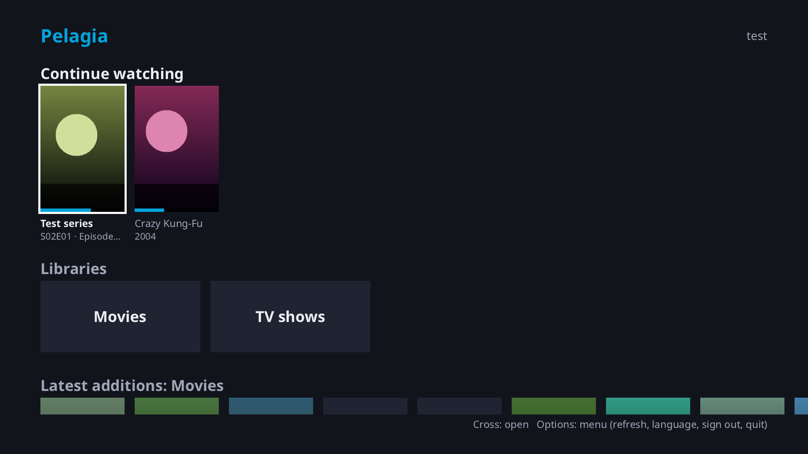
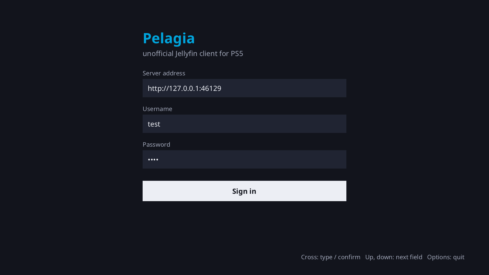
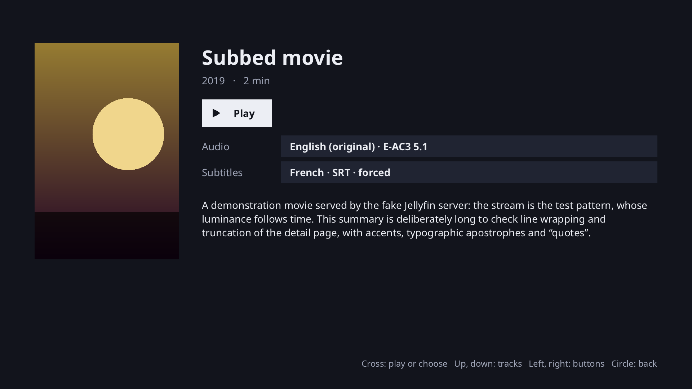
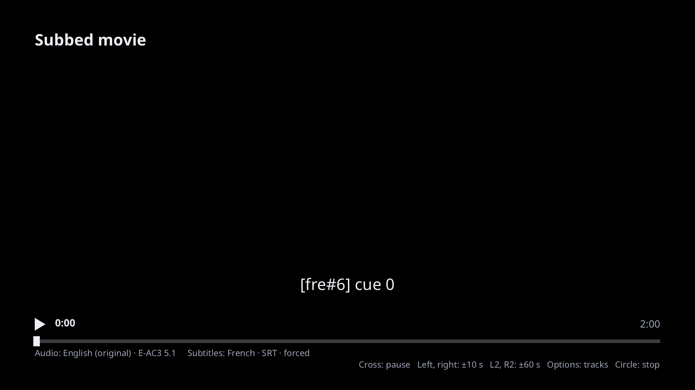

# Pelagia — unofficial Jellyfin client for PS5

🇫🇷 [Lire en français](README.fr.md)

**Pelagia** brings **Jellyfin on PS5**: a native Jellyfin client for jailbroken PlayStation 5
consoles (homebrew), driven entirely with the controller. Browse your self-hosted Jellyfin libraries,
pick audio and subtitle tracks and watch your movies and series on your TV, resuming where you stopped.

> **Pelagia is an unofficial project.** *Jellyfin is a trademark of the Jellyfin project; Pelagia is not
> affiliated with the Jellyfin project or with Sony.* PlayStation and PS5 are trademarks of Sony
> Interactive Entertainment. Pelagia is meant for hardware you own and media you are entitled to watch.



| | | |
|---|---|---|
|  |  |  |

*(Screenshots in English; the interface is also available in French, see [Features](#features).)*

## Features

- Sign in to your Jellyfin server with an on-screen keyboard; the session is kept (token only, the
  password is never stored).
- Home screen with **Continue watching**, libraries and latest additions; poster grids; movie and
  episode pages; series > seasons > episodes.
- 1080p playback with software decoding: the Jellyfin server transcodes to H.264 + AAC, or streams
  the video directly when it can. Pause, seek (±10 s, ±60 s), automatic resume, buffering and
  reconnection after network drops. Your position and watched state are reported to the server.
- **Audio and subtitle selection**, before and during playback, preselected from your Jellyfin profile
  (preferred languages, subtitle mode, remembered choices). Text subtitles (SRT, ASS as plain text)
  are drawn by Pelagia without transcoding; image subtitles (PGS, VobSub) are burned in by the server.
- Interface in **English and French**: the language follows the system when the console reports it,
  otherwise English; it can always be chosen in **Options** > *Language* (see Known limitations).
- Easy install from a USB stick or over FTP. The device shows up as "Pelagia (PS5)" on your Jellyfin
  dashboard.

## Works with Jellyfin

Pelagia talks to the Jellyfin REST API of your own server (a Jellyfin client for PlayStation 5, nothing
more). Versions it has been tested with:

| Component | Tested with |
|---|---|
| Jellyfin server | **12.1.0** (other versions: not tested yet) |
| Connection | **HTTP only** for now (HTTPS is planned; use your server's local `http://` address) |

## Requirements

- A PS5 with a working jailbreak and homebrew launcher. **Tested with:** firmware **13.60** (Relapse
  jailbreak) with these tools loaded by the webkit autoloader: etaHEN, kstuff lite, ftpsrv, websrv,
  ShadowMountPlus and a PKG manager. Other firmware versions and setups are not tested.
- [websrv](https://github.com/ps5-payload-dev/websrv) running on the console: it provides the launcher in
  which Pelagia appears.
- A Jellyfin server on your network, reachable over HTTP, and a Jellyfin account.
- For the USB install: a USB stick formatted as **exFAT**. For the FTP install:
  [ftpsrv](https://github.com/ps5-payload-dev/ftpsrv) (port 2121) and an FTP client.

## Install from a USB stick

For someone comfortable with the jailbreak. websrv looks for homebrew in
`/mnt/usbN/homebrew/<Name>/`, so the release is organised for that.

1. Download `Pelagia-vX.Y.Z-ps5.zip` from the
   [Releases page](https://github.com/steredbits/pelagia/releases) (check it against `SHA256SUMS`).
2. Format a USB stick as **exFAT** (or use one you already have).
3. **Unzip the archive at the root of the stick.** You must end up with:
   ```
   <stick>/homebrew/Pelagia/eboot.elf
   <stick>/homebrew/Pelagia/sce_sys/icon0.png
   ```
   (`INSTALL.txt` also lands at the root; you can delete it.)
4. *(Optional)* To skip typing the server address, copy `pelagia.conf.example` to `pelagia.conf` in the
   same folder and set `server=http://192.168.1.x:8096`. Never put a user name or password in it.
5. Plug the stick into the PS5, then run your jailbreak so that websrv is running.
6. Open the websrv launcher and start **Pelagia**.

Pelagia **always** stores its session, poster cache and logs in `/data/homebrew/Pelagia/` on the console,
never on the USB stick. Updating = replacing the files on the stick; your session stays on the console.

## Install over FTP (alternative)

1. Unzip the release on your computer.
2. With your FTP client, connect to the console (ftpsrv, port **2121**) and copy the `homebrew/Pelagia`
   folder to `/data/homebrew/Pelagia/` (it must contain `eboot.elf` and `sce_sys/icon0.png`).
3. Start **Pelagia** from the websrv launcher.

From a computer with this repository, `tools/deploy-ps5.sh --zip Pelagia-vX.Y.Z-ps5.zip <ps5-ip>`
does the copy for you (add `--launch` to start the app, `--conf pelagia.conf` to send the optional
configuration, `--logs` to fetch the last log).

## First start

1. Enter your Jellyfin server address (`http://192.168.1.x:8096`), your user name and your password with
   the on-screen keyboard (or let `pelagia.conf` pre-fill the address).
2. Next launches reopen the session automatically. **Options** > *Sign out* signs out.

`pelagia.conf` is looked up on the USB stick first (`/mnt/usb0` … `/mnt/usb7`,
`homebrew/Pelagia/pelagia.conf`), then in `/data/homebrew/Pelagia/`. It is only read, only `server=` is
used, and it only applies when no session is saved.

## Controls

| Action | Controller |
|---|---|
| Move | D-pad, left stick |
| Select | Cross (✕) |
| Back | Circle (○) |
| Menu (Options) | Options |
| Erase (on-screen keyboard) | Square (□) |
| Play / pause | Triangle (△) |
| Seek −10 s / +10 s | L1 / R1 |
| Seek −60 s / +60 s | L2 / R2 |
| Quit | Options menu > *Quit Pelagia* |

On the movie page, **down** then **Cross** on the Audio / Subtitles lines to choose a track. During
playback, **Options** opens the same choice.

## Known limitations

- **HTTP only** (no HTTPS yet): use the local `http://` address of your server.
- **Black screen after quitting** when launched from the websrv launcher: close the launcher by hand.
- **1080p, software decoding**: no 4K, HDR or hardware decoding yet. The server transcodes what the
  console cannot decode.
- The interface is in **English or French**. On the PS5, the system language cannot be read yet (the
  SDL port has no locale backend), so Pelagia starts in English: switch with **Options** > *Language*,
  the choice is saved. The embedded font covers Latin scripts (other scripts show up as �). ASS subtitle styling (colors, positions) is not reproduced.
- Tested only with firmware 13.60 and Jellyfin 12.1.0 (see above). No multi-user support.

## Troubleshooting

- **Where are the logs?** In `/data/homebrew/Pelagia/logs/pelagia.log` on the console (the previous runs
  are kept as `pelagia.1.log` and `pelagia.2.log`). Read them over FTP (ftpsrv, port 2121). Tokens and
  passwords are masked, but the log contains your server address: remove it before sharing a log.
- **Pelagia does not show up in the launcher**: check that `eboot.elf` and `sce_sys/icon0.png` are in
  `<stick>/homebrew/Pelagia/` (not in an extra sub-folder after unzipping), that the stick is exFAT, and
  that websrv is running.
- **"Serveur injoignable"** (server unreachable): check the address, that it starts with `http://`, that
  the console and the server are on the same network, and the server port (8096 by default).
- **Wrong password / session expired**: sign in again from the login screen.
- **A crash to report**: the `eboot.elf` of a release is stripped. The release also has
  `pelagia-debug-symbols.elf`, the same build with its symbols; you do not need it to run Pelagia,
  it only helps to analyze a crash (it is listed in `SHA256SUMS`).
- **Playback is slow to start**: the server may be transcoding; the first frames can take several seconds.
- **To start from scratch**: delete `/data/homebrew/Pelagia/data/` (session and poster cache) over FTP.

## Building from source

Pelagia is C++17 with CMake. The portable code runs on Linux, which is where development and tests
happen; the PS5 build is a cross-compilation with the open-source
[ps5-payload-dev SDK](https://github.com/ps5-payload-dev/sdk) and its PacBrew libraries.

```bash
# Linux: libcurl, ffmpeg (libav*), SDL2, python3 (fake server for the tests)
cmake -B build-linux -DPLATFORM=linux && cmake --build build-linux -j
ctest --test-dir build-linux --output-on-failure
./build-linux/pelagia --server http://<ip>:8096

# Try it without a Jellyfin server (user test / password test)
python3 tools/fake_jellyfin_server.py --make-media /tmp/mire.mp4 --seconds 600
python3 tools/fake_jellyfin_server.py --media /tmp/mire.mp4 --port 8096 --catalog demo

# PS5: install the SDK, then cross-compile (build-ps5/Pelagia/eboot.elf)
ci/install-ps5-sdk.sh && export PS5_PAYLOAD_SDK=/opt/ps5-payload-sdk
ci/build-ps5.sh

# Release zip (what the release workflow publishes)
python3 tools/package_release.py --version 0.1.0 --pkg-dir build-ps5/Pelagia
```

Releases are built by GitHub Actions when a `vX.Y.Z` tag is pushed (`.github/workflows/release.yml`).

## Contributing

Bug reports, logs (without your server address), ideas and pull requests are welcome: see
[CONTRIBUTING.md](CONTRIBUTING.md) and [docs/ARCHITECTURE.md](docs/ARCHITECTURE.md). The plan for the next
versions is in [ROADMAP.md](ROADMAP.md); changes are listed in [CHANGELOG.md](CHANGELOG.md).

## License

Pelagia is free software under the **GNU GPL v3 or later** (GPL-3.0-or-later, [LICENSE](LICENSE)). It includes or links third-party
components, listed with their licenses in [THIRD_PARTY_NOTICES](THIRD_PARTY_NOTICES) (FFmpeg and x264 are
GPL, which is why Pelagia is GPL too).

*Jellyfin is a trademark of the Jellyfin project. Pelagia is not affiliated with the Jellyfin project or
with Sony.*
